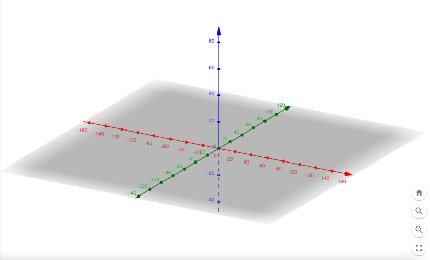
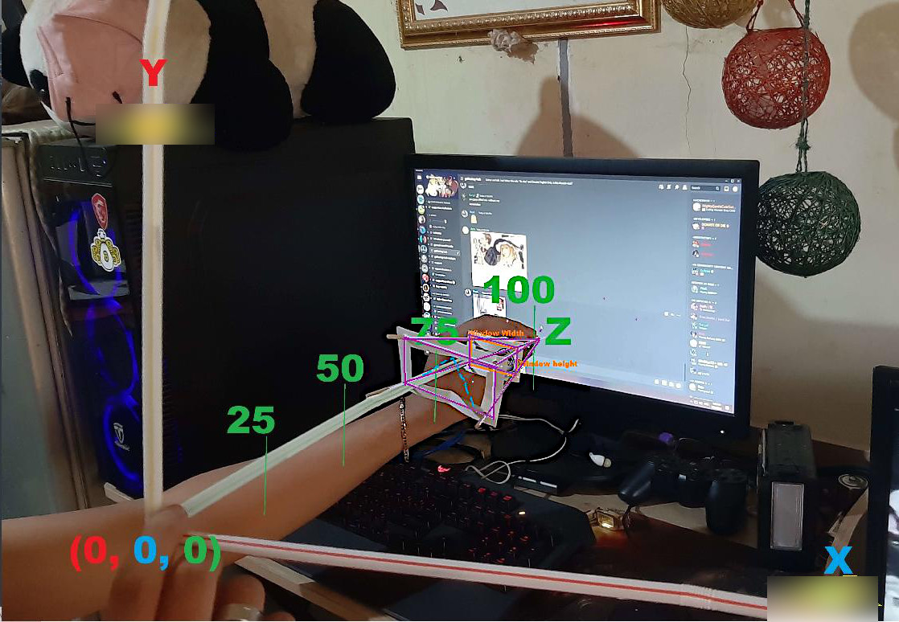
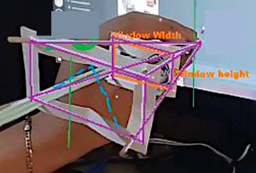

# How to Interpret the Drawing Lines tutorial from three.js documentation

**[See my answer](https://stackoverflow.com/questions/73210565/how-to-interpret-the-drawing-lines-tutorial-from-three-js-documentation#73719651)** :)

Let's go over the commands used in the creation of lines as suggested by the three.js documentation.

## One by one

## First line

```js
const scene = new THREE.Scene()
```

It says "create scene" but what it really does is to <mark>create a 3D space</mark> like as shown in the Picture 1.


<br>

## Second line

```js
const fov = 45;
const aspect = window.innerWidth / window.innerHeight;
const near = 1;
const far = 500;

const camera = new THREE.PerspectiveCamera( fov, aspect, near, far );
```

It says <mark>create a Camera</mark>, given is the:

- field of view, 
- aspect ratio, 
- distance from camera to near viewing plane, and 
- distance from camera to far viewing plane


<br>

## Third line

```js
camera.position.set( 0, 0, 100 );
```

It says <mark>**position** the camera on the z-axis</mark> as shown in Picture 4.

*the orientation of the camera*

Puts the camera at 100 units along the z-axis, parallel to the z-axis because it hasn't been rotated.


<br>

## Fourth line

```js
camera.lookAt( 0, 0, 0 );
```

It says <mark>orient the camera in the direction</mark> of the point (0, 0, 0) as shown in Picture 5.


<br>

## Fifth line

```js
const renderer = new THREE.WebGLRenderer();
```

It says the WebGL <mark>Renderer shall be ready</mark> when it will be summoned by calling its name.

<br>

## Sixth line

```js
renderer.setSize( window.innerWidth, window.innerHeight );
```

It says the window where the user will see, will be adjusted by renderer. This window is your computer screen. <mark>Whatever the size of your computer screen, the renderer will adjust accordingly.</mark>

<br>

## Seventh line

```js
document.body.appendChild( renderer.domElement );
```

<mark>Adds the `<canvas>` element to your HTML document.</mark>

It's one of the few commands that have nothing to do with 3D space.

<br>

## Eighth line

```js
const material = new THREE.LineBasicMaterial( { color: 0x0000ff } );
```

It says we have to <mark>set the properties</mark> of the future line first before actually drawing it. In this case, this future line will have a color of blue as shown in Picture 9.


<br>

## Ninth line

```js
const points = [];
```

Whatever inside the array will become "real", something that can be put inside the viewing frustrum of the camera where it will be rendered in the near future.

<br>

## Tenth line

```js
points.push( new THREE.Vector3( - 10, 0, 0 ) );

points.push( new THREE.Vector3( 0, 10, 0 ) );

points.push( new THREE.Vector3( 10, 0, 0 ) );
```

It says position the points specified by the Vector3 command and these points will be pushed along the three points positioned in the 3D space. The points doesn't appear yet because the renderer isn't yet summoned as shown in Picture 11.


<br>

## Eleventh line

```js
const geometry = new THREE.BufferGeometry().setFromPoints( points );
```

It says the points positioned by the Vector 3 will be <mark>converted into renderable form</mark> by the Buffer Geometry because a Buffer Geometry is a representation of mesh, line, or point geometry as shown in Picture 12.


[CPM 3D Plotter](https://technology.cpm.org/general/3dgraph/)

<br>

## Twelfth line

```js
const line = new THREE.Line( geometry, material );
```

It says <mark>the line will be created, based on the geometry and material</mark> set beforehand as shown in Picture 13.


<br>

## Thirteenth line

```js
scene.add( line );
```

It says <mark>the line has been added to the 3D space</mark> inside the viewing frustrum of the camera as shown in Picture 14.





<br>

## Fourteenth line

```js
renderer.render( scene, camera );
```

It says the renderer has been ordered to <mark>render the scene and the camera.</mark>

Actually, it renders everything that's been added to the scene.

*You already added the lines with `scene.add(line)`, so there's no reason to specifically target `line` again.*

<br>

# Resources

Some of your screenshots use different axes systems. To get acquainted with the Three.js/WebGL coordinate system, I recommend you visit [the Three.js editor](https://threejs.org/editor/) and add a camera with `Add > PerspectiveCamera` (near the bottom). You can then modify its position attributes to see what the axes do. Also keep an eye on the axes widget on the corner:


```text
x-axis: +right / -left
y-axis: +up / -down
z-axis: +toward user / - away
```

<br>

<!--https://www.ilovefreesoftware.com/06/featured/online-3d-graphing-free-websites.html-->

[GeoGebra](https://www.geogebra.org/3d?lang=en) is one of the best 3D graphing websites to plot 3D functions, surfaces, draw solids, and do other things.

[Changing Axes and Scale](https://www.geogebra.org/m/hhMY7dDj)

<br>

[CPM 3D Plotter](https://technology.cpm.org/general/3dgraph/) provides a nice interface where you can graph planes and points and then see the output preview on 3D axes.

<br>

[Graph Points in 3D Using 3D Calc Plotter](https://youtu.be/HWOMz3eHE7Q)
